# Pokémon Face Mesh Adventure - Final Project Writeup

**Author:** Luis Ibarra  
**Course:** CIS 25 - C++ Programming  
**Date:** July 2025  
**Project:** Final Face Mesh Application

---

## 📋 Project Overview

The **Pokémon Face Mesh Adventure** is an interactive C++ application that combines real-time computer vision, object-oriented programming, and database integration. The application uses OpenCV for face detection, applies Pokémon-themed mask overlays, generates dynamic particle effects triggered by mouth movement, and stores user data in MongoDB.

### Key Features

- ✨ Real-time face detection and landmark generation
- 🎭 5 different Pokémon mask overlays (Mudkip, Meowth, Eevee, Sylveon, Pikachu)
- 🌊 Mouth-activated particle systems (water, coins, gems, hearts, lightning)
- 💾 MongoDB database integration for photo and analytics storage
- 🎮 Interactive CLI interface with real-time controls
- 📸 Photo capture with timestamped filenames
- 🔧 Adjustable mask positioning system

---

## 🏗️ Program Architecture & Design

### Object-Oriented Design Principles

The application follows clean architecture principles with clear separation of concerns:

```
┌─────────────────┐    ┌──────────────────┐    ┌─────────────────┐
│   CLI Interface │────│   FaceMeshApp    │────│  MongoDB Handler│
│   (User Input)  │    │  (Core Logic)    │    │  (Data Storage) │
└─────────────────┘    └──────────────────┘    └─────────────────┘
                               │
                    ┌──────────┼──────────┐
                    │          │          │
              ┌─────────┐ ┌─────────┐ ┌─────────┐
              │Particle │ │Face     │ │OpenCV   │
              │System   │ │Types    │ │Vision   │
              └─────────┘ └─────────┘ └─────────┘
```

### Core Classes

#### 1. **FaceMeshApp** (Main Controller)

```cpp
class FaceMeshApp {
private:
    VideoCapture camera;                    // Camera capture
    CascadeClassifier face_cascade;         // Face detection
    ParticleSystem particle_system;         // Particle effects
    unique_ptr<MongoDBHandler> mongo_handler; // Database handler

public:
    void run();                            // Main application loop
    vector<DetectedFace> detectFacesWithMesh(const Mat& image);
    bool detectMouthOpenSimple(const Mat& face_roi);
};
```

#### 2. **CLIInterface** (User Interaction)

```cpp
namespace CLIInterface {
    void displayWelcomeBanner();
    void displayPokemonMenu();
    pair<string, string> getPokemonSelection();
    bool testMongoDBConnection(const string& connection_string);
}
```

#### 3. **ParticleSystem** (Visual Effects)

```cpp
class ParticleSystem {
private:
    vector<unique_ptr<BaseParticle>> particles;
    string particle_type;

public:
    void setParticleType(const string& type);
    void startEmission();
    void update();
    void draw(Mat& image);
};
```

#### 4. **MongoDBHandler** (Data Persistence)

```cpp
class MongoDBHandler {
public:
    bool saveFaceData(const vector<DetectedFace>& faces,
                     const string& filename,
                     const string& pokemon,
                     const string& mask_file);
    pair<int, int> getStatistics();
    void showFaceDatabase();
};
```

---

## 📊 Data Structures

### Primary Data Structures

#### 1. **DetectedFace Structure**

```cpp
struct DetectedFace {
    Rect rect;                          // Face bounding rectangle
    Point2f center;                     // Center point of face
    float confidence;                   // Detection confidence score
    vector<FaceLandmark> landmarks;     // 68 facial landmark points
    vector<Point2f> face_mesh;          // Generated mesh points
    double face_angle;                  // Face rotation angle
    bool mouth_open;                    // Mouth state detection
    Point2f mouth_center;               // Center of mouth for particles
};
```

#### 2. **FaceLandmark Structure**

```cpp
struct FaceLandmark {
    Point2f point;                      // 2D coordinate (x, y)
    int landmark_id;                    // Unique identifier (0-67)
    string landmark_name;               // Descriptive name
};
```

#### 3. **Landmark Mapping System**

The application generates 68 facial landmarks organized as:

- **Jaw line**: 17 points (indices 0-16)
- **Eyebrows**: 10 points (17-26)
- **Nose**: 9 points (27-35)
- **Eyes**: 12 points (36-47)
- **Mouth**: 20 points (48-67)

#### 4. **Particle Inheritance Hierarchy**

```cpp
class BaseParticle {
protected:
    Point2f position, velocity;
    Scalar color;
    float life, max_life;
public:
    virtual void update() = 0;
    virtual void draw(Mat& image) = 0;
};

// Derived classes: WaterParticle, CoinParticle, GemParticle,
//                  HeartParticle, LightningParticle
```

---

## 🔄 Program Flow

### 1. **Initialization Phase**

```mermaid
graph TD
    A[Program Start] --> B[Display Welcome Banner]
    B --> C[Initialize MongoDB Instance]
    C --> D[Load Environment Variables]
    D --> E[Test Database Connection]
    E --> F[Display Pokémon Selection Menu]
    F --> G[User Selects Pokémon]
    G --> H[Initialize FaceMeshApp]
```



### 2. **Application Setup**

```cpp
// Constructor initialization sequence
FaceMeshApp::FaceMeshApp() {
    initializeLandmarkNames();      // Setup 68 landmark names
    loadFaceDetectionModels();      // Load OpenCV Haar cascades
    loadMaskImage();                // Load selected Pokémon mask
    initializeCamera();             // Setup video capture
    setupParticleSystem();          // Configure particle effects
}
```

### 3. **Main Application Loop**

```cpp
void FaceMeshApp::run() {
    while (true) {
        camera >> frame;                           // Capture frame
        auto faces = detectFacesWithMesh(frame);   // Detect faces
        Mat display_frame = drawFaceWithMouthEmoji(frame, faces);

        // Handle user input
        int key = waitKey(1) & 0xFF;
        if (key == ' ') processFrame(frame, "camera");  // Save photo
        else if (key == 'q') break;                     // Quit
        // Handle mask positioning (w/s/a/d keys)

        imshow("Pokemon Face Mesh", display_frame);
    }
}
```

### 4. **Face Detection Pipeline**


### 5. **Mouth Detection Algorithm**

```cpp
bool FaceMeshApp::detectMouthOpenSimple(const Mat& face_roi) {
    // 1. Define mouth region (75% down the face)
    // 2. Convert to grayscale and blur
    // 3. Get cheek brightness as reference
    // 4. Count dark pixels in mouth area
    // 5. Calculate dark pixel ratios
    // 6. Apply threshold logic for mouth open detection
    return (very_dark_ratio > 0.12f) || (dark_ratio > 0.35f && very_dark_ratio > 0.05f);
}
```

---

## 🎮 GUI and User Interface

### Command Line Interface

The application features a rich CLI experience:

#### Welcome Screen

```
═══════════════════════════════════════════════════════════════
🎮             POKÉMON FACE MESH ADVENTURE                🎮
═══════════════════════════════════════════════════════════════
     ✨ Real-time Face Detection with Pokémon Magic! ✨
```

#### Pokémon Selection Menu

```
🎭 Choose your Pokémon companion:
1. 🌊 Mudkip  - Water type with splash effects
2. 🪙 Meowth  - Normal type with coin effects
3. 💎 Eevee   - Normal type with gem effects
4. 💖 Sylveon - Fairy type with heart effects
5. ⚡ Pikachu - Electric type with lightning effects
```

#### Real-time Controls

- **SPACE**: Capture photo and save to database
- **W/S**: Move mask up/down
- **A/D**: Move mask left/right
- **R**: Reset mask position
- **I**: Show database statistics
- **Q/ESC**: Quit application

### Visual Interface

The OpenCV window displays:

- **Live camera feed** with face detection
- **Pokémon mask overlay** positioned on detected face
- **Dynamic particle effects** from mouth center
- **Control instructions** overlaid on screen
- **Mouth state indicator** (MOUTH OPEN/CLOSED)

---

## 💾 Database Integration

### MongoDB Schema

```javascript
// Face analysis collection
{
  "_id": ObjectId,
  "timestamp": ISODate,
  "filename": "facemesh_Mudkip_20250722_225616_1.jpg",
  "pokemon": "Mudkip",
  "mask_file": "mudkip_mask.png",
  "faces_detected": 1,
  "face_data": {
    "landmarks": [...],  // 68 facial landmarks
    "confidence": 1.0,
    "face_angle": -2.3,
    "mouth_open": true,
    "face_center": {"x": 640, "y": 360}
  }
}
```

### Database Operations

```cpp
// Save face analysis data
bool saveFaceData(const vector<DetectedFace>& faces,
                 const string& filename,
                 const string& pokemon,
                 const string& mask_file);

// Retrieve statistics
pair<int, int> getStatistics(); // Returns (total_captures, total_faces)

// Display database contents
void showFaceDatabase();
```

---

## 🔧 Technical Implementation Details

### Computer Vision Algorithms

#### 1. **Face Detection**

- Uses OpenCV's Haar Cascade Classifier
- Processes frames at 30 FPS
- Selects largest detected face for stability
- Applies histogram equalization for better detection

#### 2. **Landmark Generation**

```cpp
// Procedural landmark generation based on face rectangle
vector<FaceLandmark> generateFacialLandmarks(const Rect& face_rect) {
    // Generate 68 landmarks using mathematical formulas
    // Jaw: curved line using sine function
    // Eyes: circular patterns around centers
    // Nose: vertical line with variations
    // Mouth: elliptical pattern around center
}
```

#### 3. **Mouth Detection**

- **Multi-line scanning**: Analyzes multiple horizontal lines in mouth region
- **Dynamic thresholding**: Uses cheek brightness as reference
- **Pixel classification**: Counts dark pixels indicating mouth cavity
- **Ratio analysis**: Applies statistical thresholds for open/closed determination

### Particle Systems

#### Particle Types and Behaviors

```cpp
// Water particles (Mudkip)
class WaterParticle : public BaseParticle {
    void update() override {
        // Gravity simulation with splash effects
        velocity.y += gravity;
        position += velocity;
        // Fade over time
    }
};

// Coin particles (Meowth)
class CoinParticle : public BaseParticle {
    void update() override {
        // Spinning motion with arc trajectory
        rotation += angular_velocity;
        // Golden shimmer effect
    }
};
```

### Memory Management

- **Smart pointers**: `unique_ptr` for MongoDB handler
- **RAII principles**: Automatic resource cleanup
- **OpenCV Mat objects**: Efficient image memory management
- **Vector containers**: Dynamic particle storage

---

## 📈 Performance Characteristics

### Optimization Strategies

1. **Frame rate optimization**: 30 FPS target with efficient processing
2. **Memory efficiency**: Reuse of OpenCV Mat objects
3. **Particle culling**: Automatic cleanup of expired particles
4. **Database batching**: Efficient MongoDB operations
5. **ROI processing**: Focus computation on face regions only

### System Requirements

- **CPU**: Modern multi-core processor for real-time processing
- **Memory**: 4GB+ RAM for OpenCV operations and particle systems
- **Camera**: USB webcam with 720p+ resolution
- **Network**: Internet connection for MongoDB Atlas

---

## 🧪 Testing and Validation

### Test Cases Implemented

1. **Face detection accuracy**: Various lighting conditions and angles
2. **Mouth detection sensitivity**: Fine-tuned thresholds for reliability
3. **Mask positioning**: Dynamic adjustment system
4. **Database connectivity**: Error handling and fallback mechanisms
5. **Particle performance**: Smooth animation under various loads

### Error Handling

```cpp
// Robust error handling throughout
try {
    // MongoDB operations
} catch (const mongocxx::exception& e) {
    cout << "❌ Database error: " << e.what() << endl;
}

// Camera initialization checks
if (!camera.isOpened()) {
    cout << "❌ No camera detected." << endl;
    return;
}
```

---

## 🚀 Build System and Dependencies

### Makefile Configuration

```makefile
# Compiler flags for optimization and warnings
CXXFLAGS = -std=c++17 -Wall -Wextra -O2

# OpenCV and MongoDB linking
LIBS = -lopencv_core -lopencv_imgproc -lopencv_highgui \
       -lopencv_objdetect -lopencv_imgcodecs -lopencv_dnn \
       -lopencv_videoio -lmongocxx._noabi -lbsoncxx._noabi
```

### Project Structure

```
final/
├── src/
│   ├── core/           # Main application logic
│   ├── database/       # MongoDB integration
│   ├── headers/        # Class declarations
│   ├── interface/      # CLI user interface
│   └── particles/      # Particle system implementations
├── images/             # Pokémon mask files
├── main.cpp           # Application entry point
├── Makefile           # Build configuration
└── README.md          # Documentation
```

---

## 🎯 Learning Outcomes Demonstrated

### C++ Programming Concepts

1. **Object-Oriented Programming**: Classes, inheritance, polymorphism
2. **Memory Management**: Smart pointers, RAII principles
3. **STL Containers**: Vectors, strings, pairs
4. **Template Programming**: Generic particle system design
5. **Exception Handling**: Robust error management
6. **File I/O**: Image loading and environment configuration

### Advanced Topics

1. **Computer Vision**: OpenCV integration and image processing
2. **Database Integration**: MongoDB C++ driver usage
3. **Real-time Processing**: Efficient frame processing loops
4. **Mathematical Algorithms**: Facial landmark generation
5. **Build Systems**: Makefile configuration and dependency management

### Software Engineering Practices

1. **Code Organization**: Clean architecture with separation of concerns
2. **Documentation**: Comprehensive inline comments and README
3. **Version Control**: Git integration with meaningful commits
4. **Testing**: Thorough validation of all major components
5. **User Experience**: Intuitive CLI interface and real-time feedback

---

## 📚 Code Documentation

All major classes and methods include comprehensive documentation:

```cpp
/**
 * @brief Detects whether the mouth is open using pixel analysis
 * @param face_roi Region of interest containing the face
 * @return true if mouth is detected as open, false otherwise
 *
 * Algorithm:
 * 1. Defines mouth region (75% down face, center 20% width)
 * 2. Converts to grayscale and applies Gaussian blur
 * 3. Uses cheek area as brightness reference (60% threshold)
 * 4. Scans mouth region counting dark pixels
 * 5. Applies statistical analysis with dual thresholds
 */
bool FaceMeshApp::detectMouthOpenSimple(const Mat& face_roi);
```

---

## 🎬 Demo Video Content Structure

The PowerPoint presentation and demo video should cover:

### Slides 1-3: Introduction

- Project title and objectives
- Technology stack overview
- Key features demonstration

### Slides 4-6: Architecture

- Class diagram and relationships
- Data structure explanations
- Program flow visualization

### Slides 7-9: Implementation

- Code snippets of key algorithms
- Face detection pipeline
- Mouth detection algorithm details

### Slides 10-12: GUI and User Experience

- CLI interface screenshots
- Real-time application demo
- Interactive controls demonstration

### Slides 13-15: Database Integration

- MongoDB schema design
- Data storage examples
- Statistics and reporting features

### Slides 16-18: Live Demo

- Application startup and Pokémon selection
- Real-time face detection with different masks
- Mouth-activated particle effects
- Photo capture and database storage
- Mask positioning controls

### Slides 19-20: Conclusion

- Learning outcomes achieved
- Future enhancement possibilities
- Technical challenges overcome

---

## 🏆 Project Achievements

This final project successfully demonstrates:

- ✅ **Complex C++ Programming**: Multi-class architecture with inheritance
- ✅ **Real-time Computer Vision**: OpenCV integration for face detection
- ✅ **Database Integration**: MongoDB connectivity and data persistence
- ✅ **Interactive User Interface**: Rich CLI with real-time controls
- ✅ **Mathematical Algorithms**: Facial landmark generation and mouth detection
- ✅ **Memory Management**: Efficient resource handling with smart pointers
- ✅ **Code Documentation**: Comprehensive commenting and documentation
- ✅ **Build System**: Professional Makefile configuration
- ✅ **Error Handling**: Robust exception handling throughout

The **Pokémon Face Mesh Adventure** represents a culmination of C++ programming skills, demonstrating both technical proficiency and creative problem-solving in an engaging, interactive application.
